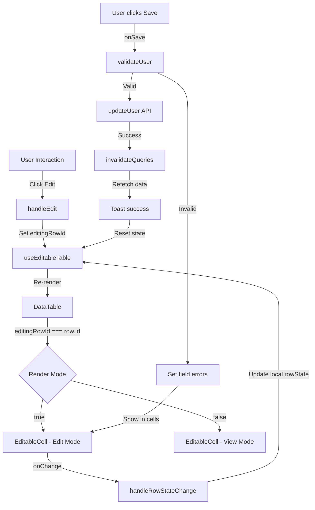

# NexusGrid Design & Architecture Documentation

## 🏗️ Core Philosophy

NexusGrid treats the table not just as a component, but as a **mini-framework** within the app. The design philosophy centers on:

1. **Separation of Concerns**: Logic and presentation are decoupled
2. **Type Safety**: Full TypeScript with Zod for runtime validation
3. **Extensibility**: Easy to add new column types, validators, and formatters
4. **Reusability**: Composable components and hooks
5. **Single Responsibility**: Each component does one thing well

## 🧱 Architectural Layers

```
┌─────────────────────────────────────────┐
│         Presentation Layer              │
│  (ShadCN UI Components + Tailwind)      │
├─────────────────────────────────────────┤
│         Component Layer                 │
│  (DataTable, EditableCell, Toolbar)     │
├─────────────────────────────────────────┤
│         State Management Layer          │
│  (useEditableTable Hook + Validation)   │
├─────────────────────────────────────────┤
│         Data Layer                      │
│  (TanStack Query + Mock API)            │
├─────────────────────────────────────────┤
│         Utility Layer                   │
│  (Formatters, Validators, Helpers)      │
└─────────────────────────────────────────┘
```

## 📊 Data Flow Diagram



## 🔄 State Management Flow

### useEditableTable Hook

The custom hook manages three primary concerns:

```typescript
// 1. TanStack Table State
const table = useReactTable({
  data,
  columns,
  getCoreRowModel,
  getPaginationRowModel,
  getSortedRowModel,
  getFilteredRowModel,
});

// 2. Editing State
const [editingRowId, setEditingRowId] = useState<number | null>(null);
const [rowState, setRowState] = useState<Partial<User>>({});

// 3. Error State
const [errors, setErrors] = useState<Record<string, string>>({});
```

**Why this structure?**
- Keeps logic separate from presentation
- Easy to test individual concerns
- Clear props interface for DataTable

## 🔀 Column Metadata System

Each column definition includes optional metadata to drive behavior:

```typescript
interface ColumnDef<User> {
  accessorKey: 'salary';
  header: 'Salary';
  meta?: {
    editable: boolean;    // Allow inline editing
    type: 'currency';     // Input type selector
    required: boolean;    // Validation requirement
    validator?: ZodType;  // Custom validation
  };
}
```

**Type Mapping:**
| Type | Input Component | Formatter | Parser |
|------|-----------------|-----------|--------|
| `text` | `<Input />` | Identity | Identity |
| `number` | `<Input type="number" />` | Stringified | parseFloat |
| `currency` | `<Input type="number" />` | `formatCurrency` | `parseCurrency` |
| `date` | `<Input type="date" />` | `formatDate` | `parseDate` |
| `select` | `<Select />` | Identity | Identity |
| `checkbox` | `<Switch />` | Checkmark display | Boolean |

## ✅ Validation Pipeline

```
User Input → EditableCell
    ↓
handleRowStateChange (local update)
    ↓
User clicks "Save"
    ↓
validateUser(rowState)
    ↓
Zod Schema Validation
    ├─ Valid → API Call
    ├─ Invalid → fieldErrors mapped to cells
    └─ Cells re-render with error borders
```

### Zod Schema Structure

```typescript
const userSchema = z.object({
  id: z.number(),
  name: z.string()
    .min(1, 'Name is required')
    .min(2, 'Name must be at least 2 characters'),
  email: z.string().email('Invalid email address'),
  salary: z.number().positive('Salary must be positive'),
  // ... more fields
});
```

**Error Mapping:**
- Zod errors → fieldErrors object
- Keys match column.id for cell-level display
- Errors clear as user types (via handleRowStateChange)

## 🎯 Component Responsibilities

### DataTable.tsx
**Purpose**: Orchestrate TanStack Table with ShadCN UI
**Responsibilities**:
- Accept columns, data, and callbacks
- Render table rows via TanStack
- Switch between view/edit modes per row
- Integrate EditableCell
- Display action buttons
- Handle visual feedback (blue highlight on edit)

**Props**:
```typescript
interface DataTableProps {
  table: TanStackTableInstance;
  editingRowId: number | null;
  rowState: Partial<User>;
  errors: Record<string, string>;
  onEdit: (row: User) => void;
  onSave: (rowData: Partial<User>) => Promise<void>;
  onCancel: () => void;
  onDelete: (userId: number) => Promise<void>;
  onRowStateChange: (field: keyof User, value: any) => void;
}
```

### EditableCell.tsx
**Purpose**: Smart cell renderer with view/edit mode switching
**Responsibilities**:
- Detect editing state
- Render appropriate input component based on column.meta.type
- Apply formatters in view mode
- Parse values from inputs
- Display error styling
- Handle onChange events

**Type-to-Component Mapping Logic**:
```typescript
if (meta?.type === 'currency') {
  return <Input type="number" ... />;
} else if (meta?.type === 'date') {
  return <Input type="date" ... />;
} else if (meta?.type === 'select') {
  return <Select ... />;
} // ... more types
```

### TableToolbar.tsx
**Purpose**: Search and filter interface
**Responsibilities**:
- Render search input
- Connect to TanStack globalFilter
- Debounce search (optional enhancement)
- Clear search button

### TablePagination.tsx
**Purpose**: Pagination controls
**Responsibilities**:
- Display current page info
- Previous/Next buttons
- Hook into TanStack pagination state

### Layout Components (Sidebar, Header, Layout)
**Purpose**: Shell and navigation
**Responsibilities**:
- Responsive sidebar navigation
- Theme toggle in header
- Route-aware highlighting
- Mobile menu toggle

## 🔌 API Layer Design

### Mock API (lib/api.ts)

```typescript
// In-memory data store
let mockUsers: User[] = [...];

// Simulated delays (500ms) for realism
const delay = (ms: number) => new Promise(r => setTimeout(r, ms));

// CRUD operations
export const fetchUsers = async (): Promise<User[]>;
export const updateUser = async (user: User): Promise<User>;
export const deleteUser = async (userId: number): Promise<void>;
export const createUser = async (user: Omit<User, 'id'>): Promise<User>;
```

**Why this approach?**
- No backend needed for development
- Realistic network delays teach async patterns
- Easy to replace with real API endpoints
- Perfect for interview demonstrations

## 🎨 Styling Architecture

### Design Token System

```css
:root {
  --background: 0 0% 100%;
  --foreground: 0 0% 3.6%;
  --primary: 0 0% 9.0%;
  --muted: 0 0% 96.1%;
  /* ... more tokens */
}

.dark {
  --background: 0 0% 3.6%;
  --foreground: 0 0% 98.2%;
  /* ... inverted tokens */
}
```

**Usage in Components**:
```tsx
<div className="bg-background text-foreground">
  <button className="bg-primary text-primary-foreground">
    Save
  </button>
</div>
```

### Tailwind Integration
- Utility-first approach
- Design tokens as CSS custom properties
- Responsive prefixes (md:, lg:, etc.)
- Dark mode via `.dark` class toggle

## 🔑 Key Extensibility Points

### 1. Adding a New Column Type

**Step 1**: Update `types/index.ts`
```typescript
type: 'currency' | 'date' | 'phone' | 'percent' | 'email';
```

**Step 2**: Add formatter/parser in `lib/formatters.ts`
```typescript
export const formatPhone = (value: string): string => {
  // Implementation
};
```

**Step 3**: Add input handler in `EditableCell.tsx`
```typescript
if (meta?.type === 'phone') {
  return <Input value={value} onChange={...} />;
}
```

**Step 4**: Add validation in `userSchema.ts`
```typescript
phone: z.string().regex(/^\d{10}$/, 'Invalid phone');
```

### 2. Custom Validators

```typescript
// Define in userSchema.ts
const customValidation = z.object({
  fieldA: z.number(),
  fieldB: z.string(),
}).refine(
  (data) => data.fieldA < 100,
  { message: "FieldA must be less than 100" }
);
```

### 3. Custom Hooks

Extend `useEditableTable` for specific features:
```typescript
export const useMultiSelectTable = () => {
  const { ...tableLogic } = useEditableTable(...);
  const [selected, setSelected] = useState<number[]>([]);
  
  return { ...tableLogic, selected, setSelected };
};
```

## 🧪 Testing Strategy

### Unit Tests (Component Level)
```typescript
describe('EditableCell', () => {
  it('renders span in view mode', () => {
    render(<EditableCell isEditing={false} ... />);
    expect(screen.getByText('value')).toBeInTheDocument();
  });
  
  it('renders input in edit mode', () => {
    render(<EditableCell isEditing={true} ... />);
    expect(screen.getByRole('textbox')).toBeInTheDocument();
  });
});
```

### Integration Tests (Feature Level)
```typescript
describe('Table Editing', () => {
  it('edits a row and saves with validation', async () => {
    // 1. Render TablePage
    // 2. Click edit on row
    // 3. Update field
    // 4. Click save
    // 5. Verify API called
    // 6. Verify data updated
  });
});
```

### Validation Tests
```typescript
describe('userSchema', () => {
  it('validates valid user', () => {
    const valid = userSchema.parse(validUser);
    expect(valid).toBeDefined();
  });
  
  it('rejects invalid email', () => {
    expect(() => userSchema.parse({ ...user, email: 'invalid' }))
      .toThrow();
  });
});
```

## 🎯 Design Decisions & Trade-offs

### 1. Row-level vs Cell-level Editing
**Decision**: Row-level editing
**Reasoning**:
- Simpler validation (entire row context)
- Better UX (clear save/cancel actions)
- Prevents partial saves
- Easier to implement undo/redo

### 2. TanStack Table (Headless) vs Material-UI Table
**Decision**: TanStack Table
**Reasoning**:
- Complete logic control
- Integrates seamlessly with ShadCN
- No hidden assumptions
- Highly composable

### 3. Zod vs Other Validators
**Decision**: Zod
**Reasoning**:
- TypeScript-first design
- Excellent error messages
- Composable schemas
- Built-in transforms
- Small bundle size

### 4. In-Memory API vs Backend
**Decision**: In-memory mock
**Reasoning**:
- No setup required
- Perfect for interviews/demos
- Easy to replace with real API
- Teaches async/await patterns

## 📈 Performance Considerations

### Render Optimization
- Use `useMemo` for column definitions (never change reference)
- Avoid inline object/function creation in render
- useCallback for event handlers in hooks

### Query Optimization
- TanStack Query caching prevents re-fetching
- Pagination limits DOM nodes rendered
- Debounced search reduces processing

### Memory Management
- Mock API stores data in closure
- No memory leaks from event listeners
- Cleanup in useEffect (if used)

## 🔐 Security Considerations

1. **Input Validation**: All inputs validated via Zod
2. **XSS Prevention**: React escaping + no dangerouslySetInnerHTML
3. **Error Messages**: Generic messages for API errors
4. **Type Safety**: TypeScript prevents type confusion

## 📚 Reusability Matrix

| Component | Reusable | Customizable | Standalone |
|-----------|----------|--------------|-----------|
| DataTable | ✅ | ✅ | ❌ (requires data/callbacks) |
| EditableCell | ✅ | ✅ | ✅ |
| TableToolbar | ✅ | ✅ | ✅ |
| TablePagination | ✅ | ✅ | ✅ |
| useEditableTable | ✅ | ⚠️ (hard to extend) | ✅ |
| Layout | ⚠️ (app-specific) | ✅ | ✅ |

## 🚀 Optimization Roadmap

### Phase 1 (Current)
- Basic editing and validation
- In-memory mock API
- Single table view

### Phase 2
- Server-side pagination
- Column visibility toggle
- Batch operations

### Phase 3
- Real-time collaboration
- Undo/redo stack
- Advanced filtering
- Export to CSV/Excel

### Phase 4
- Role-based access control
- Audit logging
- Time-travel debugging

---

**This architecture is designed for clarity, maintainability, and scalability.**
**Every decision prioritizes clean code and extensibility.**
